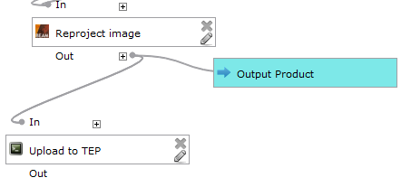
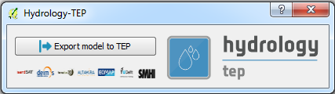
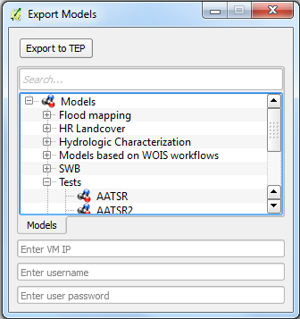

# hep-qgis-plugin-lite

This repository includes the lite version of the H-TEP Plugin to be installed on local instances of QGIS. This plugin allows the users that own a WOIS Virtual Machine on H-TEP to export models from local QGIS to the H-TEP portal.

To install the plugin on your local QGIS follow the instructions below:

1. After the WOIS installation, copy the content of src/plugins to the directory C:\Users\user\.qgis2\python\plugins

**Note:** Replace the folder C:\Users\user\.qgis2\python\plugins\processing from the WOIS installation. All the necessary files are also in the new one.

2. Copy the content of src/scripts/WOIS to the directory C:\Users\user\.qgis2\processing/scripts/WOIS

The plugin was tested on QGIS 2.18.3 Las Palmas with the latest version of WOIS installed (4.1).

# How to use the plugin

This H-TEP Plugin Lite allows the users that own a WOIS Virtual Machine on H-TEP to export models from local QGIS to the H-TEP portal.

**Usecase:**

1. The user create a QGIS model (with the libraries available from WOIS)
2. The user tests the model locally
3. After testing, the user shall add the script "Upload to TEP" as a last step of the model

**Note:** This step will allow the users to check the outputs in the H-TEP portal after run a job

4. Connect the VPN
5. Click the plugin button (H-TEP icon) 
6. Selec the option "Export to model"

7. Select the model to export and insert the WOIS VM IP, username and password

8. Export the model to the VM
9. The model will be available in the H-TEP portal after the user login

**Note: The script "Upload to TEP", in local instances of QGIS, cannot be used. It is only to be added at the end of a model, before export it to H-TEP.**
